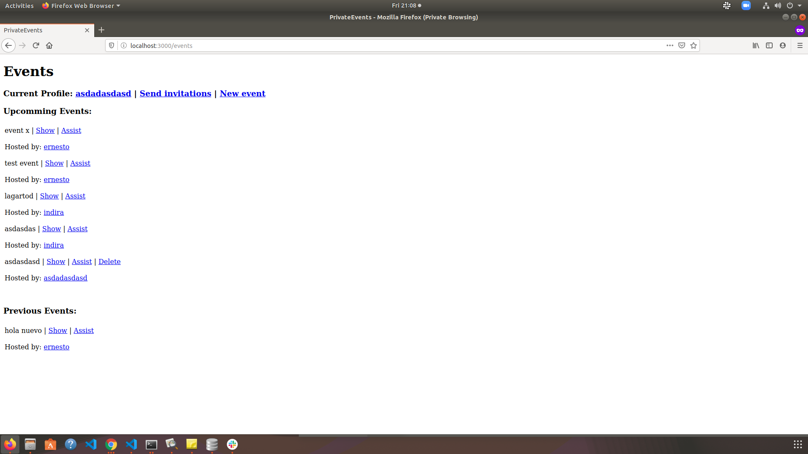

# Project 3: Private events

## Project specifications
You want to build a site similar to a private Eventbrite which allows users to create events and then manage user signups. Users can create events and send invitations and parties (sound familiar?). Events take place at a specific date and at a location (which you can just store as a string, like “Andy’s House”).

## Built With

* Ruby on Rails

Tools used on this project

- Visual Studio Code
- VSCode Ruby by Stafford Brunk
- Rubocop for Visual Studio Code
- Capybara
- Rspec
- Simple forms


## Instructions to run the project

+ Open terminal on your workspace with
```
cd /home/projects_workspace/..
```
+ Cloning the project input the next code:
```
git clone git@github.com:idgm5/private-events.git
```
+ Navigate to the folder of the project
```
cd /private-events/
```
Migrate the database
```
rails db:migrate
```
Populating with data
```
rake db:setup
```
Run the server
```
rails server
```

## Live preview 

[Click here to see the live preview ](https://priv-events.herokuapp.com/)

## Screenshot



## Authors


👤 **Ruben Paz Chuspe**

- Github: [@rubenpazch](https://github.com/rubenpazch)
- Linkedin: [rubenpch](https://www.linkedin.com/in/rubenpch/)

👤 **Isaac Gonzalez**

- Github: [@idgm5](https://github.com/idgm5)
- Twitter: [@idgm5](https://twitter.com/idgm5)
- Linkedin: [Isaac Gonzalez](https://www.linkedin.com/in/isaacmunguia)


## Contributing

This is an education project as a part of the Microverse so contributing is not accepted.

Contributions, issues and feature requests are welcome!

Feel free to check the [issues](https://github.com/enelesmai/enumerable-methods/issues).

## Show your support

Give a ⭐️ if you like this project!

## Acknowledgements

+ [Github](http://github.com/).
+ [The Odin Project](theodinproject.com/).

## License

This project is [MIT](lic.url) licensed.
